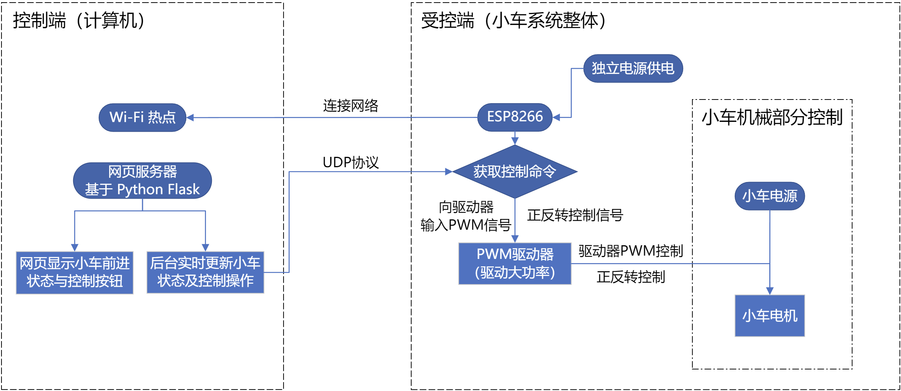

# EET-RemoteControlled-Car

 Advanced task of Electronical Trainee

 Using `ESP8266` with `MicroPython`

## 硬件构成

 控制器:&emsp;`ESP8266`

 供电:
  
  - EVB: 2 * AA 电池 + 1 * DC-DC 升压模块 (in 3V, out 5V 500-600mA USB-A)
  - 车体: 1 * 3.7V 锂电池
 
 PWM 驱动模块:

  - 2 * 双路驱动模块

   | PWM 信号电压 | 电源电压 | 单路工作电流 |
   | ---------- | -------- | ---------- |
   | 1.8V-7V    | 2V-10V    | 1.5A (max. 2.5A)  |

   | 正向驱动 | 反向驱动 | 待机 | 停机 |
   | ------- | ----- | ------------ | --------|
   | IN 1/3 = 1/PWM   IN 2/4 = 0 | IN 1/3 = 0   IN 2/4 = 1/PWM | IN 1/3 = 0   IN 2/4 = 0 | IN 1/3 = 1   IN 2/4 = 1 |

## 控制方案示意图

## 程序构建

 - `ESP8266` 开发：MicroPython
 - 前台网页实现：Python Flask 框架
